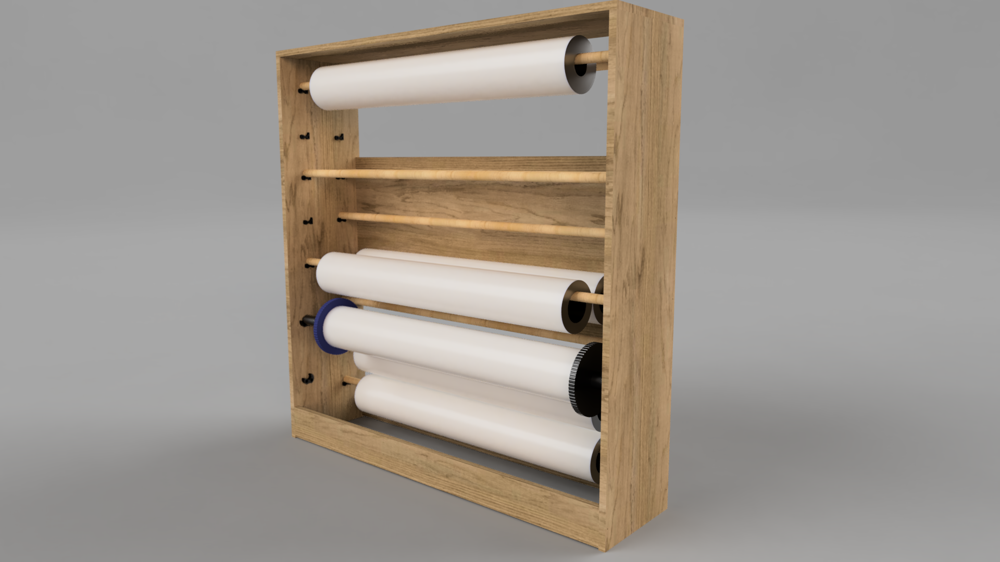
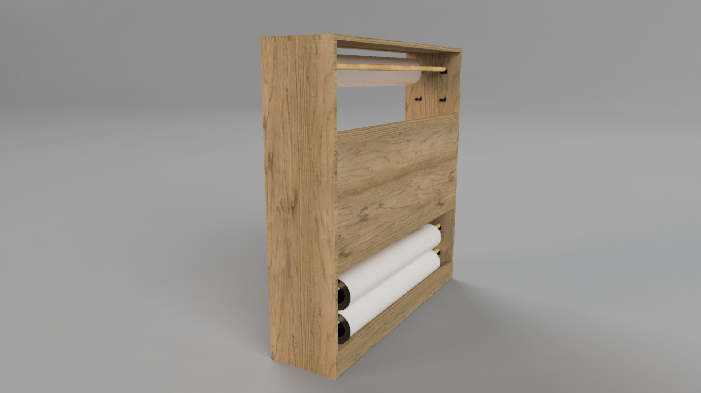
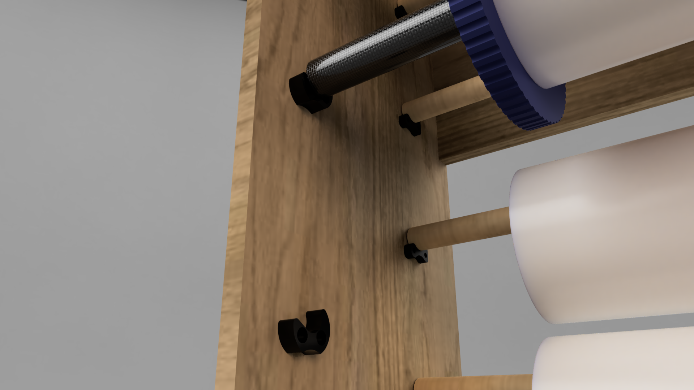
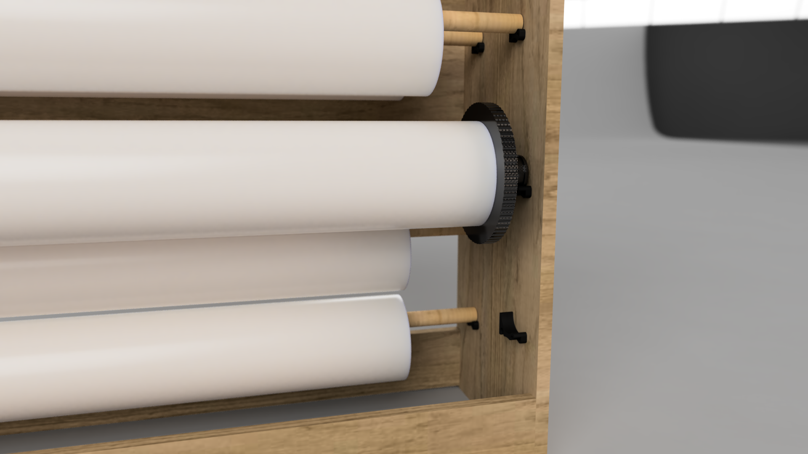

# Papirhylle
Dette er byggetegninger for en oppbevaringshylle for printerpapir på rull. Hyllen passer til 42 toms papirruller (1067mm bred). Hyllen er designet for å kunne bygges med hobbyplater med så lite kutting som mulig.

## Materialer
* 3 stk Hobbyplate 18mm x 1200mm x 300mm
* 1 stk Hobbyplate 18mm x 1200mm x 200mm
* 1 stk Hobbyplate 18mm x 1200mm x 500mm
* 13 kosteskaft 24mm diameter
* Trelim
* 26 stk av [Brakett.stl](Brakett.stl)
* 2 stk av [BrakettSpindelH.stl](BrakettSpindelH.stl)
* 2 stk av [BrakettSpindelV.stl](BrakettSpindelV.stl)
* 18 stk 6mm treplugger
* 14 stk treskruer med forsenket hode til sammenføyninger
* 60 stk treskruer med linsehode til brakettene

## Bilder

Bilde 1 - Foran

Bilde 2 - Bak

Bilde 3 - Spindel har annerledes brakett enn kosteskaftene

Bilde 4 - Spindel på høyre side

## Byggetegninger
[Byggetegningen](drawing.pdf) er i skala 1:10 og skrives ut på A3 ark.
[Malen](drilling_guide.pdf) for boring av hull til skruer og treplugger er i skala 1:2. For å få denne ut i skala 1:1 må den printes som 200% av original størrelse.
